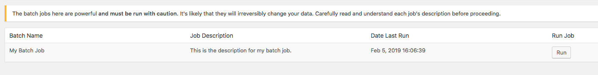

# Ramsey Batch

A WordPress plugin that provides a framework to handle large data processing jobs by breaking it into smaller chunks and running each job individually via AJAX requests.

## Installation

The recommended method of installation is via [Composer](https://getcomposer.org/).

### Composer

For more information on using Composer to manage WordPress plugins, [read this guide](https://deliciousbrains.com/using-composer-manage-wordpress-themes-plugins/).

#### Add the repository to composer.json

1. In the `extra` object, specify that `wordpress-plugin` packages be placed in the correct directory.

```js
"installer-paths": {
  "wp-content/plugins/{$name}/": ["type:wordpress-plugin"]
}
```

Be sure that the installer path matches the path of your WordPress plugin directory.

2. In the `repositories` array of composer.json, add the following:

```js
{
  "type": "git",
  "url": "git@github.com:RamseyInHouse/wp-ramsey-batch.git"
}
```

3. In the `require` object, add:

```js
"RamseyInHouse/wp-ramsey-batch": "^1.0"
```

If you'd like a different version of the plugin, check the [Releases](https://github.com/RamseyInHouse/wp-ramsey-batch/releases) section of Github. This plugin adheres to [semantic versioning guidelines](https://getcomposer.org/doc/articles/versions.md).

4. Run `composer install` to install the plugin.

### Download and Install

You can download the plugin files here and add them to the `plugins` directory of your WordPress installation. [Follow the directions here](https://codex.wordpress.org/Managing_Plugins#Manual_Plugin_Installation_by_FTP).

## Creating a Batch Job

Before starting, be sure that the "Ramsey Batch" plugin is activated.

**Create a batch job class and register the job.**

Begin by creating a class for your batch job with a `__construct()` method. Your class _must_ extend the `\RamseySolutions\RamseyBatch\BatchJob` class.

```php
<?php

class MyBatchJob extends \RamseySolutions\RamseyBatch\BatchJob
{

    /**
     * Items to be processed one-by-one.
     * 
     * @var array
     */
    public $items = [];

    /**
     * The constructor method must always call the parent constructor. 
     * It will register the batch job into the UI using the `ramsey-batch-jobs` filter.
     */
    public function __construct()
    {
        parent::__construct();

        // After calling the parent constructor, add any logic specific to this class.
    }
}
```

Because `\RamseySolutions\RamseyBatch\BatchJob` is an abstract class, there are a few methods that your extending class must define. These required methods are stubbed out below:

```php
/**
 * Register the batch job. These values will be used to list the job in the WP admin.
 * 
 * @param  array  $jobs Array of batch job details.
 * @return array
 */
public function registerBatchJob(array $jobs) {
    $jobs[__CLASS__] = [
        'name' => 'My Batch Job',
        'description' => 'This is the description for my batch job.',
        'lastRunDate' => $this->getLastRunDate()
    ];

    return $jobs;
}

/**
 * Set the batch job items to be processed.
 * These values will be passed into your processing function one-by-one via AJAX using the `run()` method.
 * 
 * @param array $items Array of values to be processed. 
 */
protected function setItems($items) 
{
    $this->items = $items;
}

/**
 * When the batch job begins, this method is run.
 * 
 * @return string JSON string
 */
public function run() 
{
    // Update the last run date to be displayed in the UI.
    $this->updateLastRunDate();

    // Get a large batch of something, posts, users, DB records, etc. 
    // For this example, we collect all posts in a numerically indexed array.
    global $wpdb;
    $postIds = $wpdb->get_results("SELECT ID from {$wpdb->prefix}posts WHERE post_type = 'post'", ARRAY_N);

    // Set the items for later reference.
    $this->setItems($postIds);

    // Output JSON for AJAX. Items MUST be included in the payload.
    wp_send_json_success([
        'items' => $this->getItems()
    ]);
}

/**
 * Process an individual item.
 * 
 * @return array Response data.
 */
public function runItem() 
{
    // Grab the item from the AJAX request.
    $postId = $_POST['item'];

    // Set up an empty array to hold our response. As batch jobs should only be run in the WP admin by authenticated users, you can use this response to output information in the browser console.
    // You can pass any number of elements in the response array; however, the response array expects at least a 'reason' key to provide some browser output.
    // You can add a 'type' key with a value of 'warn' to output the message in the browser using console.warn() rather than console.log().
    $response = [];

    if( !$postId || !is_numeric($postId) ) {
        $response['reason'] = __FUNCTION__ . ' requires a numeric post ID.';
        wp_send_json_error($response);
    }

    $response['postId'] = $postId;

    // Let's add some post meta for each post.
    $meta_key = 'batch_meta_key';
    $meta_value = 'Your batch meta value';
    $postMetaId = add_post_meta($postId, $meta_key, $meta_value);

    if( !$postMetaId ) {
        $response['reason'] = 'Could not save post meta.';
        wp_send_json_error($response);
    }

    $response['postMetaId'] = $$postMetaId;
    $response['reason'] = "Post meta for $postId was updated to '$meta_value'.";

    // Send the JSON success message.
    wp_send_json_success($response);
}
```

**Register a batch job inside your theme or plugin.**

While the current convention is to have your batch jobs live inside your theme, this could easily be extended to have these jobs live inside other plugins. Regardless, you need to tell WordPress to include the correct files.

In your theme's `functions.php` file add:

```php
if (is_admin() && class_exists('RamseySolutions\RamseyBatch\Controllers\BatchController')) {
    RamseySolutions\RamseyBatch\Controllers\BatchController::register('MyAppNamespace\Batch\MyBatchJob');
}
```

**In the WP admin, go to Tools > Batch Jobs. You should see a table listing all registered batch jobs.**



## Running a Batch Job

In the plugin's WP admin page, click the "Run Job" button for a particular job. Once this is clicked, the following will happen:

1. The `run()` method on your class is called. This should update the 'last run date' and compile your list of items to be processed one at a time. If successful, an array of items should be logged to the browser console.
1. Once all of the batch items have been collected, the `runItem()` method of your class is called for each item in the batch. Each item from the JSON array is passed to the method individually for processing. If the item is processed successfully, it should [output a successful response](https://codex.wordpress.org/Function_Reference/wp_send_json_success) via JSON to the browser's console.

## Adding Custom Admin Table Columns

On the "Batch Jobs" page in the WordPress admin (Tools > Batch Jobs), you'll see a table of registered jobs available to run. Out of the box, each job has "Batch Name," "Job Description," "Date Last Run," and "Run Job" columns, but you may add custom columns as well.

### Registering a New Column

To add a new column, use the `ramsey-batch-table-columns` filter.

```php
/**
 * Add or remove table columns from the Batch Jobs admin page.
 *
 * @param array $columns Registered table columns.
 * @return array
 */
add_filter('ramsey-batch-table-columns', function ($columns) {
    $columns[] = [
        'id' => 'columnHeaderID',
        'name' => 'Custom Column Name',
        'contentKey' => 'myColumnNameOrSlug',
    ];
    return $columns;
});
```

The content of that newly registered column can be accessed by adding a new key to the job itself, using the `ramsey-batch-jobs` filter. This key must match the `contentKey` registered above. 

```php
add_filter('ramsey-batch-jobs', function ($jobs, $instance) {
    $jobs['MyAppNamespace\Batch\YourJob']['myColumnNameOrSlug'] = '
        <input type="file" name="fileUpload">
    ';

    return $jobs;
}, 11, 2);
```

### Accessing Column Form Inputs

If you include any form inputs inside your custom columns, the values of those inputs will be sent to the server when you run the job. You can access that data by use of the `formElementData` key on the `$_POST` object.

```php
    public function run()
    {
        $this->updateLastRunDate();

        $arrayOfFormInputValues = $_POST['formElementData'];
    }
```
